# Graph-Based Dependency Analysis for Monorepo Architectures

A graph-based dependency analysis tool that parses projects and visualizes them in Neo4j. Supports multiple languages, with focus on JavaScript and Python. Perfect for analyzing monorepos, microservices, and internal package dependencies.

## Features

### Core Features
- **Multi-language Support**: Analyze JavaScript and Python projects (scalable architecture)
- **Graph Visualization**: Store and visualize dependencies in Neo4j graph database
- **Relationship Mapping**: Track direct dependencies, dependency types (production, development, peer)
- **Package-to-Package Links**: Automatically creates Package → Package relationships for circular dependency detection

### Analysis Features ✨
- **Circular Dependency Detection**: Find and visualize circular dependencies in your codebase
- **Version Conflict Detection**: Identify when different projects use different versions of the same package
- **Shared Dependency Analysis**: Find packages used by multiple projects
- **Usage Statistics**: Track package popularity and usage patterns

### Architecture
- **Scalable Design**: Easy to extend for additional languages (Java, Go, Rust, etc.)
- **Neo4j Graph Database**: Leverage native graph queries and algorithms
- **Modular Parsers**: Language-specific parsers for flexible extension

## Roadmap

### ✅ Week 1&2 (COMPLETED)
- Basic dependency analysis
- Multi-language support (JavaScript, Python)
- Neo4j graph storage
- Basic visualization (Neo4j Desktop)
- Project and package node creation

### ✅ Week 3&4 (COMPLETED)
- **Circular dependency detection** - Find all dependency cycles
- **Version conflict detection** - Identify version mismatches across projects
- **Package-to-package linking** - Automatic relationship creation for internal packages
- **Dependency analysis** - Shared packages, usage statistics

### 🔮 Future Enhancements
- **Dependency depth analysis** - Track transitive dependency chains
- **Security vulnerability scanning** - CVE database integration
- **Graph algorithms** - PageRank, centrality measures, community detection
- **Export reports** - Generate PDF, JSON, CSV reports
- **Additional languages** - Java, Go, Rust, Ruby support
- **Source code parsing** - Deep analysis with Tree-sitter

## Prerequisites

- **Node.js** (v16 or higher)
- **Python** (for Python project analysis)
- **Neo4j** Desktop or Aura (v5.0 or higher recommended)
- **npm** or **yarn**

## Installation

### 1. Clone the Repository
```bash
git clone <repository-url>
cd Graph-Based-Dependency-Analysis-for-Monorepo-Architectures
```

### 2. Install Dependencies
```bash
npm install
```

### 3. Setup Neo4j

#### Option A: Neo4j Desktop (Recommended)

1. Download and install [Neo4j Desktop](https://neo4j.com/download/)
2. Create an Instance Name: `dependency-analyzer`
3. Create a new database:
   - Name: `dependency-db`           
   - Set a password
   - Click "Create"
3. Start the database (click "Start" button)

#### Option B: Neo4j Aura (Cloud)

1. Sign up at [Neo4j Aura](https://neo4j.com/cloud/aura/)
2. Create a free instance
3. Note your connection URI and credentials

### 4. Configure Environment Variables

Create a `.env` file in the project root:
```env
NEO4J_URI=bolt://localhost:7687
NEO4J_USER=neo4j
NEO4J_PASSWORD=your-password-here
NEO4J_DATABASE=dependency-db
```

**Alternative: System environment variables**
```bash
# Add to ~/.bashrc or ~/.zshrc
export NEO4J_URI=bolt://localhost:7687
export NEO4J_PASSWORD=your-password-here
export NEO4J_DATABASE=dependency-db
```

Then reload:
```bash
source ~/.bashrc
```

## Quick Start

### 1. Test Neo4j Connection
```bash
node src/graph/neo4jClient.js
```

### 2. Create Sample Company Monorepo
```bash
node src/utils/createCircularSamples.js
```

This creates a realistic company monorepo with 5 microservices:
- **authService** - Authentication & authorization
- **userService** - User management  
- **paymentService** - Payment processing
- **sharedUtils** - Common utilities
- **dataAnalytics** - Analytics & reporting

### 3. Load Sample Projects
```bash
# Load all services
node src/index.js sample_projects/company_A/authService --clear
node src/index.js sample_projects/company_A/userService
node src/index.js sample_projects/company_A/paymentService
node src/index.js sample_projects/company_A/sharedUtils
node src/index.js sample_projects/company_A/dataAnalytics
```

### 4. Run Analysis
```bash
# Find circular dependencies
node src/analysis/analyze.js --circular
```
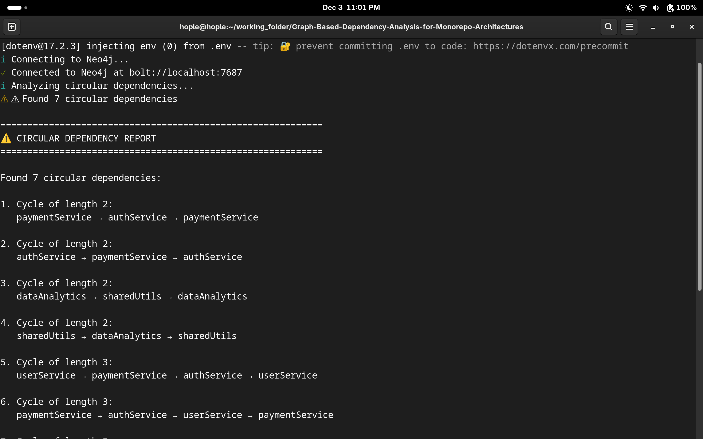
```bash
# Find version conflicts
node src/analysis/analyze.js --conflicts
```
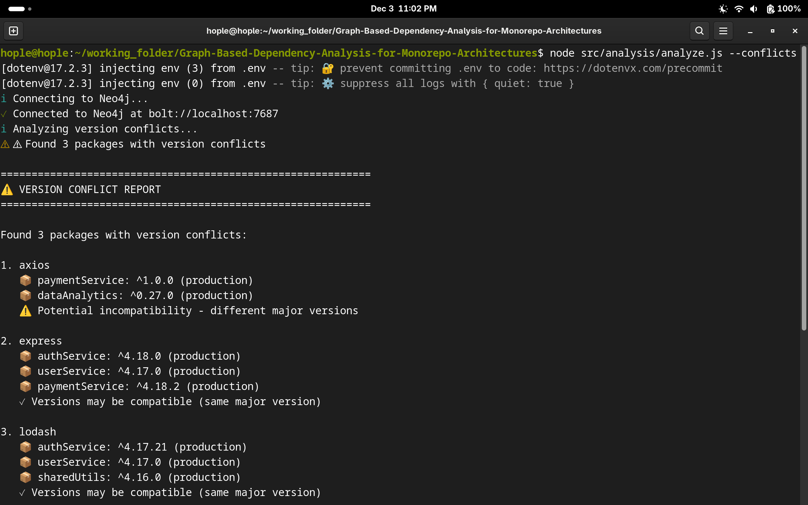
```bash
# Show statistics
node src/analysis/analyze.js --circular-stats
node src/analysis/analyze.js --conflict-stats
```
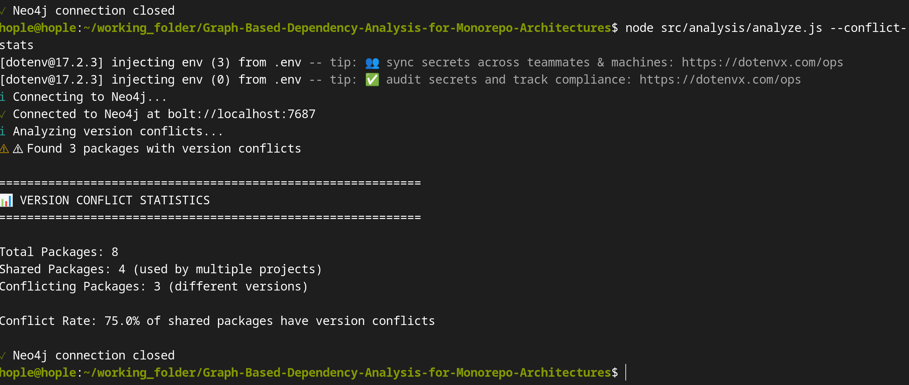

## Usage

### Analyze Your Own Projects
```bash
# Analyze a JavaScript project
node src/index.js /path/to/your/js-project

# Analyze a Python project
node src/index.js /path/to/your/python-project

# Clear database before loading
node src/index.js /path/to/project --clear
```

### Load Monorepo/Multiple Projects
```bash
# Load first project (clear database)
node src/index.js /path/to/monorepo/package1 --clear

# Load additional projects (don't clear)
node src/index.js /path/to/monorepo/package2
node src/index.js /path/to/monorepo/package3
```

## Analysis Commands

### Circular Dependency Detection
```bash
# Find all circular dependencies
node src/analysis/analyze.js --circular

# Find direct circular dependencies only (A ⟷ B)
node src/analysis/analyze.js --circular-direct
```

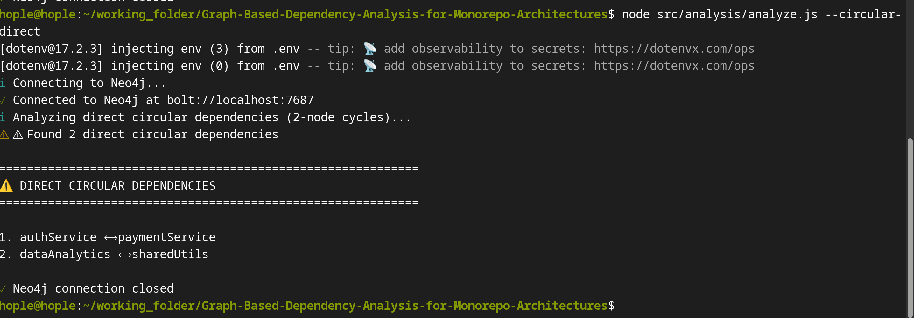

```bash
# Show circular dependency statistics
node src/analysis/analyze.js --circular-stats

# Analyze specific project
node src/analysis/analyze.js --project authService
```
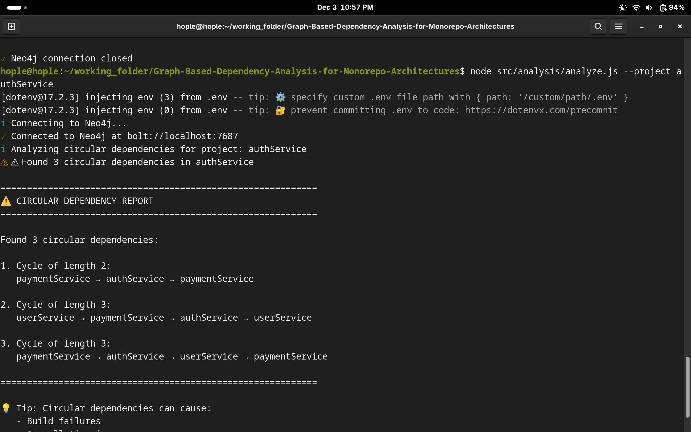


**Example output:**
```
⚠️  CIRCULAR DEPENDENCY REPORT
Found 3 circular dependencies:

1. Cycle of length 2:
   sharedUtils → dataAnalytics → sharedUtils

2. Cycle of length 2:
   authService → paymentService → authService

3. Cycle of length 3:
   authService → userService → paymentService → authService
```

### Version Conflict Detection
```bash
# Find all version conflicts
node src/analysis/analyze.js --conflicts

# Show version conflict statistics
node src/analysis/analyze.js --conflict-stats
```
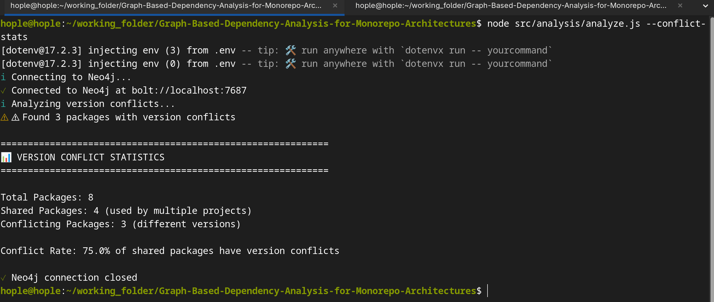
```bash
# Check specific package
node src/analysis/analyze.js --package express
node src/analysis/analyze.js --package lodash
```

**Example output:**
```
⚠️  VERSION CONFLICT REPORT
Found 3 packages with version conflicts:

1. express
   📦 authService: ^4.18.0 (production)
   📦 userService: ^4.17.0 (production)
   📦 paymentService: ^4.18.2 (production)
   ✓ Versions may be compatible (same major version)

2. axios
   📦 paymentService: ^1.0.0 (production)
   📦 dataAnalytics: ^0.27.0 (production)
   ⚠️  Potential incompatibility - different major versions
```

### Get Help
```bash
# Show all available commands
node src/analysis/analyze.js --help
```

## Neo4j Queries

After analyzing projects, open Neo4j Browser (http://localhost:7474) and try these queries:

### View All Projects
```cypher
MATCH (p:Project)
RETURN p.name, p.language, p.totalDependencies
ORDER BY p.name
```
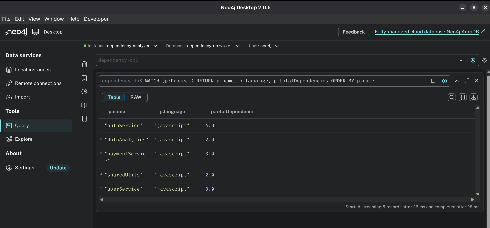
### Visualize Dependencies
```cypher
// Visualize all dependencies
MATCH path = (proj:Project)-[:DEPENDS_ON]->(pkg:Package)
RETURN path
LIMIT 50

// Visualize internal package dependencies
MATCH path = (pkg1:Package)-[:DEPENDS_ON]->(pkg2:Package)
RETURN path
```
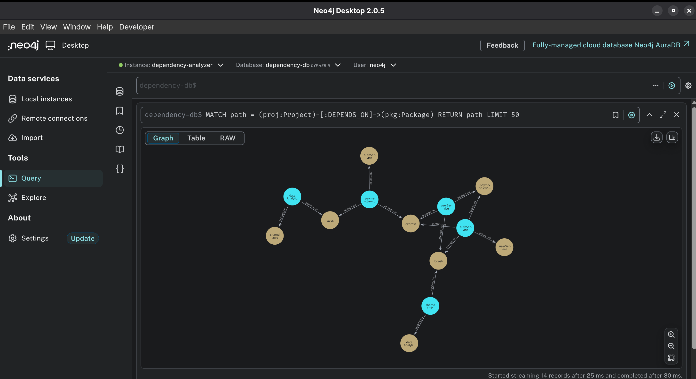
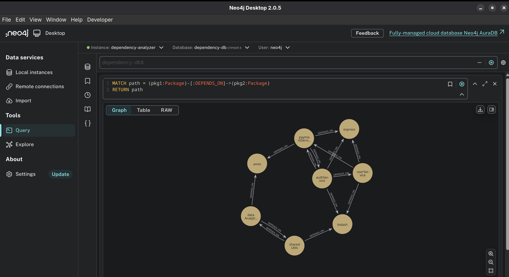
### Find Circular Dependencies
```cypher
// Find all circular dependencies
MATCH path = (p:Package)-[:DEPENDS_ON*]->(p)
WHERE length(path) > 1
RETURN path
LIMIT 10
```
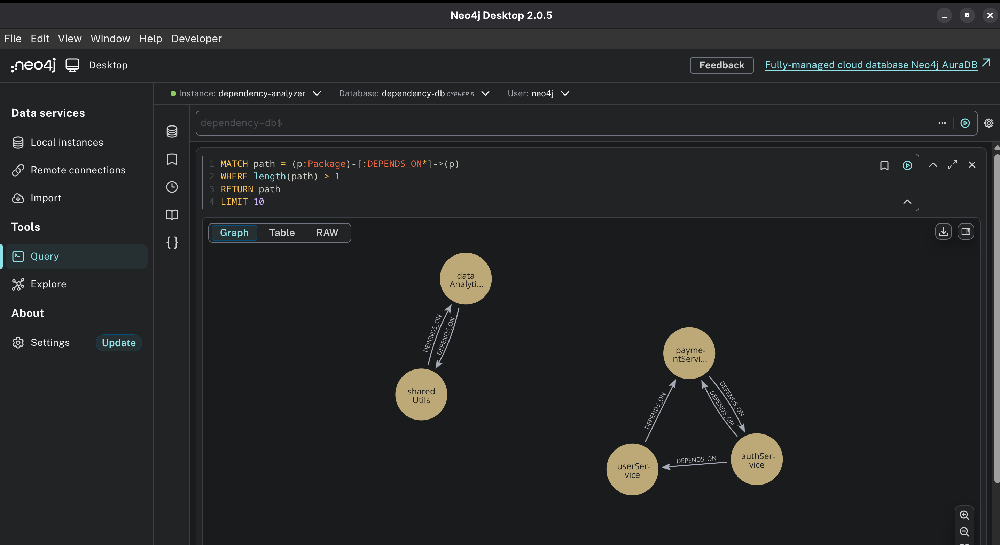
```cypher
// Find only 2-way cycles
MATCH path = (p:Package)-[:DEPENDS_ON*2]->(p)
RETURN path

// Find only 3-way cycles
MATCH path = (p:Package)-[:DEPENDS_ON*3]->(p)
RETURN path
```
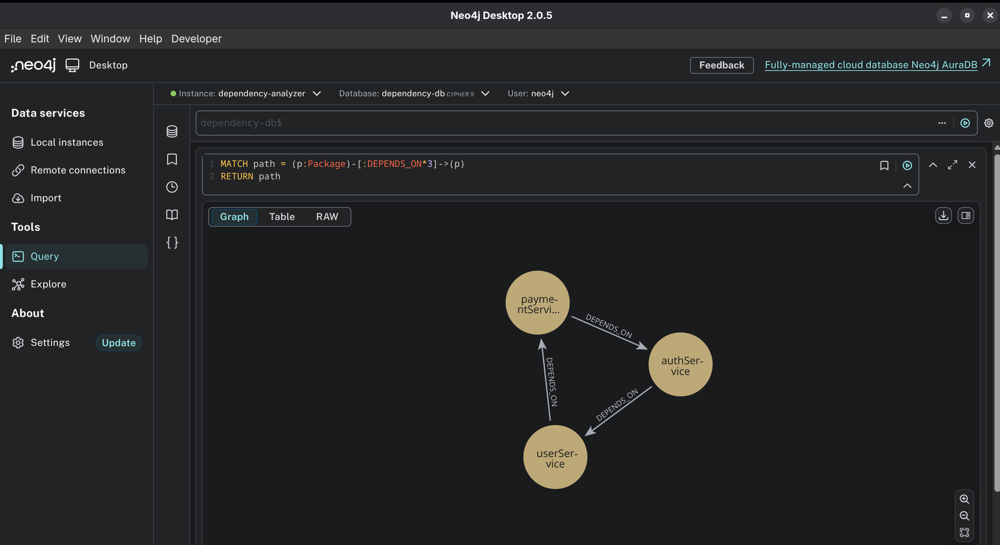
### Find Version Conflicts
```cypher
// Show all versions of a specific package
MATCH (proj:Project)-[r:DEPENDS_ON]->(pkg:Package {name: 'express'})
RETURN proj.name, r.versionConstraint
ORDER BY proj.name

// Find packages used by multiple projects
MATCH (proj:Project)-[:DEPENDS_ON]->(pkg:Package)
WITH pkg.name as packageName, count(proj) as projectCount
WHERE projectCount > 1
RETURN packageName, projectCount
ORDER BY projectCount DESC
```
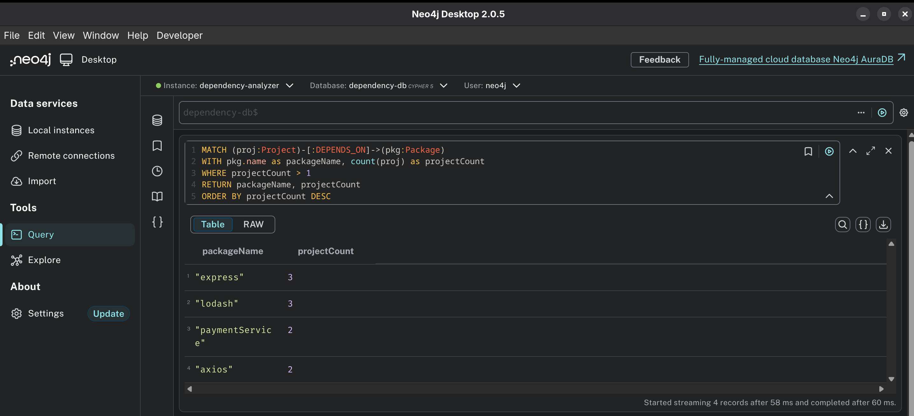

### Find Shared Dependencies
```cypher
MATCH (proj:Project)-[:DEPENDS_ON]->(pkg:Package)
WITH pkg, count(proj) as projectCount, collect(proj.name) as projects
WHERE projectCount > 1
RETURN pkg.name, pkg.version, projectCount, projects
ORDER BY projectCount DESC
```
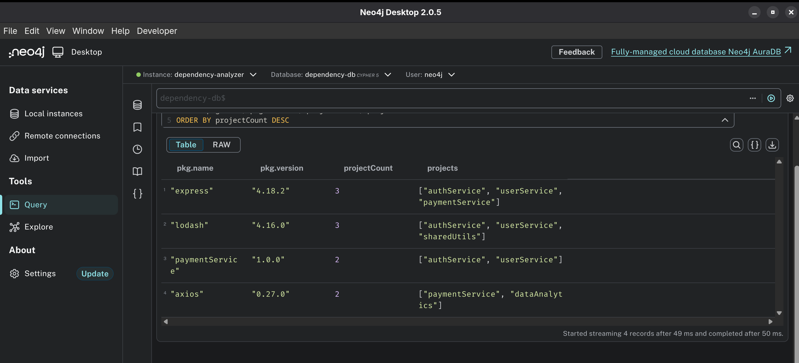
### Most Popular Packages
```cypher
MATCH (proj:Project)-[:DEPENDS_ON]->(pkg:Package)
WITH pkg, count(proj) as usageCount
RETURN pkg.name, pkg.language, usageCount
ORDER BY usageCount DESC
LIMIT 10
```
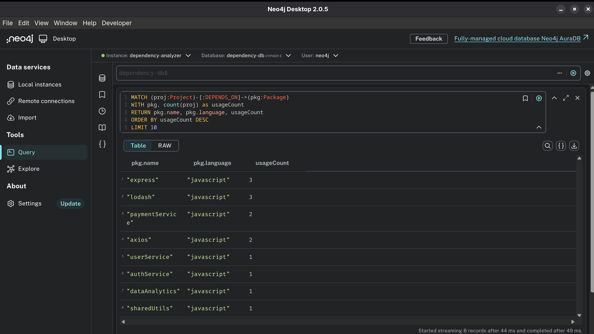

## Project Structure
```
dependency-analyzer/
├── src/
│   ├── index.js                      # Main application entry point
│   ├── graph/
│   │   ├── neo4jClient.js           # Neo4j database connection
│   │   └── builder.js               # Graph builder and queries
│   ├── parsers/
│   │   ├── javascriptParser.js      # Parse package.json
│   │   └── pythonParser.js          # Parse requirements.txt
│   ├── analysis/                     # Analysis modules (NEW!)
│   │   ├── analyze.js               # Main analysis CLI
│   │   ├── circularDependencies.js  # Circular dependency detection
│   │   └── versionConflicts.js      # Version conflict detection
│   └── utils/
│       ├── logger.js                # Logging utility
│       ├── createCompanySamples.js  # Generate sample monorepo
│       └── loadCompanyA.sh          # Batch loader script
├── sample_projects/                  # Generated sample projects
│   ├── company_A/                   # Company monorepo samples
│   ├── express_app/                 # JavaScript sample
│   └── flask_app/                   # Python sample
├── .env                             # Environment variables (create this)
├── .gitignore
├── package.json
└── README.md
```

## Neo4j Graph Model

### Nodes

- **Project**: Software project or service
  - Properties: `name`, `path`, `language`, `version`, `description`, `totalDependencies`
  
- **Package**: Dependency package (internal or external)
  - Properties: `name`, `version`, `operator`, `language`
  
- **File**: Dependency manifest files
  - Properties: `path`, `name`, `type`, `language`

### Relationships

- **DEPENDS_ON**: Project → Package or Package → Package
  - Properties: `versionConstraint`, `type` (production/development/peer), `direct`, `lineNumber`, `source`
  
- **HAS_FILE**: Project → File

### Graph Features

The tool automatically creates **Package → Package** relationships for packages that are also projects (e.g., in a monorepo). This enables:
- Circular dependency detection across internal packages
- Transitive dependency analysis
- Critical path identification

## Command Line Options

### Main Analyzer
```
Usage: node src/index.js [path] [options]

Arguments:
  path              Path to project directory

Options:
  --clear           Clear database before loading (deletes all data!)
  --sample          Create and analyze sample JavaScript project
  --sample-js       Create and analyze sample JavaScript project
  --sample-py       Create and analyze sample Python project
  --help, -h        Show help message

Examples:
  node src/index.js /path/to/project
  node src/index.js /path/to/project --clear
  node src/index.js --sample
```

### Analysis Tool
```
Usage: node src/analysis/analyze.js [options]

Circular Dependencies:
  --circular                Find all circular dependencies
  --circular-direct         Find direct circular dependencies (A ⟷ B)
  --circular-stats          Show circular dependency statistics
  --project <name>          Analyze specific project

Version Conflicts:
  --conflicts               Find all version conflicts
  --conflict-stats          Show version conflict statistics
  --package <name>          Check specific package for conflicts

Examples:
  node src/analysis/analyze.js --circular
  node src/analysis/analyze.js --conflicts
  node src/analysis/analyze.js --package express
```

## Use Cases

### 1. Monorepo Analysis

Perfect for analyzing large monorepos with multiple internal packages:
```bash
# Load entire monorepo
for dir in packages/*; do
  node src/index.js "$dir"
done

# Find circular dependencies between internal packages
node src/analysis/analyze.js --circular
```

### 2. Microservices Architecture

Analyze dependencies between microservices:
```bash
# Load each service
node src/index.js services/auth-service --clear
node src/index.js services/user-service
node src/index.js services/payment-service

# Detect circular service dependencies
node src/analysis/analyze.js --circular
```

### 3. Version Standardization

Ensure consistent package versions across projects:
```bash
# Find version conflicts
node src/analysis/analyze.js --conflicts

# Check specific package
node src/analysis/analyze.js --package lodash
```

## Troubleshooting

### Connection Failed

**Error:** `Failed to connect to Neo4j`

**Solutions:**
1. Ensure Neo4j is running (green "Active" status in Neo4j Desktop)
2. Verify `.env` credentials match your Neo4j password
3. Check `NEO4J_URI` is correct (usually `bolt://localhost:7687`)
4. For Neo4j Aura, use `neo4j+s://` protocol

### Authentication Failure

**Error:** `The client is unauthorized due to authentication failure`

**Solutions:**
1. Check password in `.env` file
2. Reset password in Neo4j Desktop: Stop DBMS → ⋮ → Reset password
3. Verify `NEO4J_USER` is `neo4j` (default)

### Database Not Found

**Error:** `Unable to get a routing table for database`

**Solutions:**
1. Check database name: `SHOW DATABASES` in Neo4j Browser
2. Update `NEO4J_DATABASE` in `.env`
3. Use default database `neo4j` if unsure

### APOC Warning

**Warning:** `APOC plugin(can be installed in Neo4j database plugin) not detected, using basic conflict detection...`

**This is normal!** The tool works perfectly without APOC. The warning is informational only. APOC provides minor performance improvements but is not required.

### No Circular Dependencies Found

If you expect circular dependencies but none are found:

1. Verify Package → Package relationships exist:
```cypher
   MATCH (pkg1:Package)-[:DEPENDS_ON]->(pkg2:Package)
   RETURN count(*) as packageLinks
```

2. If count is 0, the packages weren't linked. Ensure you loaded projects that depend on each other.

3. Use sample data to test:
```bash
   node src/utils/createCircularSamples.js
   # Then load all services
```

### 3. Test
```bash
node src/index.js /path/to/java/project --clear
node src/analysis/analyze.js --circular
```

The graph model supports any language - no schema changes needed!

## NPM Scripts
```bash
# Run analyzer on current directory
npm start

# Create and analyze sample project
npm test

# Development mode with auto-reload
npm run dev
```

Neo4j's graph database provides excellent performance even with complex dependency networks.

## Contributing

Contributions are welcome! Areas for improvement:

- Additional language parsers (Java, Go, Rust, etc.)
- Advanced graph algorithms (PageRank, community detection)
- Dependency depth analysis
- Security vulnerability scanning
- Export/report generation
- UI/dashboard

Please feel free to submit a Pull Request!


## Acknowledgments

- Built with [Neo4j](https://neo4j.com/) graph database
- Uses [neo4j-driver](https://www.npmjs.com/package/neo4j-driver) for Node.js
- Inspired by npm, pip, and other dependency management tools
- Graph database pattern from Neo4j best practices

## Real-World Applications
